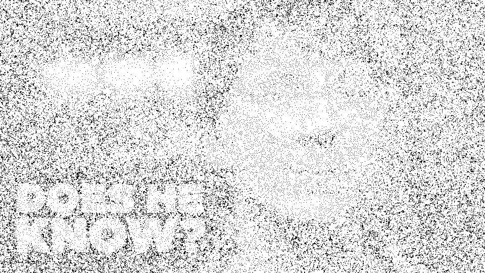

# Stipple Me This

Program image stippling berbasis **Lloyd's Algorithm**, dikerjakan dalam 4 versi (Serial CPU, Parallel CPU/OpenMP, Parallel CPU + SIMD/AVX2, GPU/CUDA) lengkap dengan benchmark harness yang mengukur waktu eksekusi, speedup, dan kesamaan hasil antar-implementasi.

| Implementation | Mean time | Speedup | Agreement vs. serial |
|---|---:|---:|---:|
| Serial CPU | 29 577 ms | 1.00x | reference |
| Parallel CPU (OpenMP, 16 threads) | 4 768 ms | **6.20x** | 0.0000 px |
| Parallel CPU + SIMD (AVX2) | 690 ms | **42.89x** | 0.0000 px |
| GPU (CUDA, kernel-only) | 249 ms | **118.71x** | 0.0000 px |

## Sample Results

Contoh berikut diambil langsung dari isi folder `output/`, hasil dari run dengan `input/DoesHeKnow.png` (960x540) pada **200.000 titik**, epsilon 1 px:



Menariknya, dengan titik sebanyak ini algoritma konvergen hanya dalam **5 iterasi** (dari maksimum yang jauh lebih besar) karena epsilon 1 px cepat terpenuhi begitu pergerakan titik antar-iterasi mengecil secara lokal. Hasilnya kelihatan: sebaran titik masih terasa mirip sampel acak awal, belum benar-benar merata seperti pada jumlah titik yang lebih moderat. Ini konsisten dengan pelajaran yang sudah berulang kali muncul selama pengembangan: **jumlah titik lebih banyak tidak otomatis berarti hasil lebih baik** -- epsilon dan iterasi maksimum juga harus disesuaikan.

Keempat mode (`_serial.png`, `_cpu.png`, `_simd.png`, `_gpu.png`) di folder yang sama menghasilkan file **byte-identical** (SHA-256 sama persis), begitu juga keempat file animasinya (`*_animation.gif`) -- bukti korektnes lintas implementasi berlaku juga di skala besar (200 ribu titik), bukan cuma di skala uji kecil.

## Build and Run

Dari Command Prompt biasa, satu perintah saja untuk build sekaligus jalan:

```bat
build.bat                              :: OpenCV terdeteksi otomatis
build.bat C:\path\to\opencv\build      :: atau tentukan lokasi manual
build.bat gui                          :: build + jalankan versi GUI
build.bat clean                        :: hapus build\ dan bin\
```

`build.bat` hanyalah pembungkus tipis, semua logika build ada di CMake. Cara manual:

```bat
cmake -S . -B build -A x64 -DOpenCV_DIR=C:/opencv/build
cmake --build build --config Release
bin\stipple.exe
```

**Satu binary, empat mode.** `bin/stipple.exe` berisi Serial, Parallel OpenMP, Parallel + SIMD, dan (bila CUDA tersedia) GPU. CUDA dan AVX2 sama-sama **dideteksi**, bukan disyaratkan: CUDA dicek saat konfigurasi (kalau toolchain tidak ada, binary tetap jadi tanpa dukungan GPU -- `STIPPLE_ENABLE_GPU=OFF` untuk melewati deteksi ini sepenuhnya), AVX2 dicek saat runtime lewat CPUID (lihat [CPU Instruction Requirements](#cpu-instruction-requirements)).

Target arsitektur GPU default adalah compute capability **8.6** (Ampere/RTX 30-series); ganti dengan `-DSTIPPLE_GPU_ARCH=75` (75 = Turing, 89 = Ada) sesuai GPU. Arsitektur yang salah tetap **berhasil di-compile** tapi gagal saat **runtime** -- cek ini duluan kalau `--mode gpu` error.

### Dependencies

**OpenCV** untuk decode/encode gambar (`imread`/`imwrite`) saja; seluruh algoritma ditulis manual. Di Windows, DLL OpenCV otomatis disalin ke sebelah executable saat build, jadi `bin\stipple.exe` bisa dijalankan dari shell mana pun atau di-double click.

Untuk dukungan GPU: **CUDA Toolkit** dan **Visual Studio** ("Desktop development with C++"). `nvcc` di Windows hanya menerima MSVC sebagai host compiler, jadi OpenCV yang dipakai juga harus **build MSVC** (unduh rilis resmi dari [opencv.org](https://opencv.org/releases/)) -- OpenCV dari MSYS2/MinGW punya ABI berbeda dan tidak akan berhasil di-link.

Di Linux, `sudo apt install build-essential cmake libopencv-dev` cukup untuk CPU, tambah `nvidia-cuda-toolkit` untuk GPU -- satu toolchain untuk semuanya, tanpa masalah ABI seperti di Windows.

### CPU Instruction Requirements

`--mode simd` butuh **AVX2** (Intel Haswell/2013 ke atas, AMD Excavator/2015 ke atas -- praktis semua CPU x86-64 modern). Tidak butuh FMA atau AVX-512, cukup AVX2, dan itu pun dicek **saat runtime** lewat `CPUID` (bukan asumsi saat compile), sehingga satu binary yang sama aman dijalankan di CPU mana pun.

Kalau CPU tidak mendukung AVX2: `--mode simd` gagal dengan pesan jelas (bukan crash instruksi ilegal), menu interaktif dan GUI otomatis menyembunyikan opsi ini, dan mode benchmark melewati baris SIMD dengan peringatan alih-alih gagal total. Kode intrinsic AVX2 sendiri terisolasi di satu file (`cpu_simd.cpp`) yang di-compile dengan flag `/arch:AVX2`/`-mavx2` khusus file itu saja, supaya bagian lain program tidak ikut memakai instruksi AVX2 tanpa sepengetahuan runtime check.

### Usage

Mode interaktif tanpa argumen: program memindai folder `input/`, menampilkan daftar gambar, lalu menanyakan jumlah titik, iterasi, epsilon, dan mode (Serial / Parallel / Parallel+SIMD, muncul hanya jika CPU mendukung AVX2 / GPU, muncul hanya jika ada CUDA device / Benchmark semua mode). Setelah itu selalu ditanya apakah ingin menyimpan animasi, termasuk saat memilih Benchmark. Ketik `q` kapan saja untuk keluar.

CLI dengan flag:

```bat
bin\stipple.exe --input input\DoesHeKnow.png --points 2000 --iterations 30 --epsilon 0.2 --output output\stipple.png --mode serial
bin\stipple.exe --input ... --mode cpu --threads 8
bin\stipple.exe --input ... --mode simd --threads 8
bin\stipple.exe --input ... --mode gpu
bin\stipple.exe --input ... --mode benchmark --repeats 3
```

Wajib: `--input`, `--points`, `--iterations`, `--epsilon`, `--output`. `--mode` default `serial`. Opsional: `--threads`, `--seed`, `--radius`, `--repeats`, `--help`. Input tidak valid langsung keluar dengan pesan error jelas.

### Animation

`--animate` menangkap posisi titik setelah **setiap** iterasi Lloyd dan menuliskannya sebagai satu file GIF animasi:

```bat
bin\stipple.exe --input input\DoesHeKnow.png --points 8000 --iterations 40 --epsilon 0.05 --output output\stipple.png --mode gpu --animate
```

Nama file GIF mengikuti nama gambar input (`output/<nama-input>_animation.gif`). Di mode benchmark, `--animate` menghasilkan **satu GIF per implementasi** yang berjalan (`_serial_animation.gif`, `_cpu_animation.gif`, `_simd_animation.gif`, `_gpu_animation.gif`), masing-masing ditempatkan di sebelah PNG mode tersebut.

Tiga jaminan penting soal fitur ini:
- **Tidak mengubah hasil.** Capture dilakukan lewat observer setelah posisi titik pada iterasi tersebut final; dibuktikan dengan PNG output yang byte-identical dengan/tanpa `--animate`.
- **Tidak merusak angka benchmark.** Di mode benchmark, frame hanya ditangkap pada **repeat terakhir** tiap mode, jadi repeat-repeat lain yang menyumbang ke mean/min/max tetap secepat tanpa animasi.
- **Tidak menggelembungkan waktu yang dilaporkan.** Waktu yang dihabiskan di dalam observer diukur lalu dikurangkan dari waktu yang dilaporkan.

Cap 300 frame mencegah run yang sangat panjang memakan memori berlebihan; kalau tercapai, program tetap sukses dan cuma memberi catatan.

### GUI

```bat
build.bat gui
```

Atau manual: `cmake --build build --config Release --target stipple_gui`, lalu jalankan `bin\stipple_gui.exe`.

**Native Win32, tanpa dependensi baru** -- memakai `user32`/`gdi32`/`comctl32`/`comdlg32` yang sudah ada di setiap instalasi Windows. GUI memanggil fungsi backend (`runOnce`/`runBenchmarkAll`) yang **persis sama** dengan yang dipakai CLI dan TUI, jadi ketiganya selalu konsisten. Windows-only karena memang toolkit GUI-nya native Windows; di Linux/WSL tetap tersedia CLI dan TUI.

Semua flag CLI punya padanan di GUI: field input/output dengan tombol Browse, field points/iterations/epsilon/seed/threads/radius/repeats, dropdown mode (opsi SIMD/GPU otomatis disembunyikan kalau tidak tersedia), checkbox "Save animated GIF" (berfungsi di semua mode termasuk Benchmark) beserta frame delay dan loop count.

Karena `runOnce`/`runBenchmarkAll` bisa berjalan lama, tombol Run menjalankannya di background thread supaya window tetap responsif -- progress bar mengikuti iterasi asli untuk mode Serial/Parallel/SIMD/GPU, dan berubah jadi indikator tak-tentu (marquee) untuk mode Benchmark.

## Implementation Strategy

Untuk titik `i`, misalkan `C_i` adalah himpunan piksel yang ditugaskan padanya dan `w_p` adalah bobot piksel `p`. Setiap iterasi memindahkan titik ke centroid berbobot sel-nya:

```
c_i = ( jumlah dari w_p * p untuk p di C_i ) / ( jumlah dari w_p untuk p di C_i )
```

Iterasi berhenti kalau pergerakan maksimum semua titik sudah di bawah `--epsilon`, atau `--iterations` tercapai.

**Pembobotan** (makin gelap piksel, makin berat, makin banyak titik di sana): piksel dikonversi ke luminance `gray = 0.299R + 0.587G + 0.114B`, lalu `weight = 1 - gray/255`. Gambar yang seluruhnya putih otomatis jatuh ke bobot seragam supaya tidak terjadi pembagian dengan nol.

**Inisialisasi**: sampling berbobot (inverse-CDF) dari `std::mt19937` dengan seed `--seed`. Keempat implementasi mulai dari titik awal yang **identik**, dihitung sekali di CPU sebelum semuanya berjalan -- ini penting supaya hasil antar-mode benar-benar bisa dibandingkan.

**Jarak**: Euclidean kuadrat untuk pencarian titik terdekat (menghindari `sqrt` di loop utama); Euclidean biasa hanya dipakai untuk cek pergerakan per-iterasi.

**Cluster kosong**: titik dengan bobot terakumulasi mendekati nol mempertahankan posisi sebelumnya, dipilih karena mudah direplikasi identik di CPU maupun GPU tanpa perlu RNG tambahan.

**Kompleksitas**: pencarian titik terdekat sengaja brute force, `O(iterasi x piksel x titik)` -- karena tujuan tugas ini memang memparalelkan beban kerja tersebut, bukan mengoptimalkannya dengan struktur data seperti k-d tree.

Implementasi per mode:

- **Serial** (`serial.cpp`): nested loop polos, tanpa threading, tanpa SIMD. Ini baseline korektnes untuk semua implementasi lain.
- **Parallel CPU** (`cpu_parallel.cpp`): loop piksel dijalankan lewat `#pragma omp parallel for`, tiap thread mengakumulasi ke buffer lokalnya sendiri (dialokasikan sekali, dipakai ulang tiap iterasi) untuk menghindari atomic/false sharing. Sengaja tidak memakai fitur OpenMP 3.1+ seperti `reduction(max:)` karena file ini juga dikompilasi MSVC yang classic `/openmp`-nya cuma OpenMP 2.0 -- reduksi max-displacement ditulis manual per-thread sebagai gantinya.
- **Parallel CPU + SIMD** (`cpu_simd.cpp`, **bonus**): struktur threading/reduksi sama persis dengan versi Parallel, hanya pencarian titik terdekatnya diproses 8 piksel sekaligus pakai AVX2 -- satu titik di-broadcast ke register 256-bit dan dibandingkan terhadap 8 piksel sekaligus. Sengaja **tidak pakai FMA** supaya urutan pembulatan floating-point identik dengan versi scalar, sehingga keputusan "titik mana yang terdekat" bit-demi-bit sama dengan Serial/Parallel -- dibuktikan lewat SHA-256 output yang identik di semua mode. Dukungan CPU dicek di runtime (lihat [CPU Instruction Requirements](#cpu-instruction-requirements)).
- **GPU** (`gpu.cu`): weight map dan titik tetap tinggal di device sepanjang run. Kernel 1: satu thread per piksel, `atomicAdd` ke akumulator titik terdekatnya (pakai `double`, bukan `float`, supaya presisinya menyamai versi CPU). Kernel 2: satu thread per titik, hitung centroid baru plus reduksi max-displacement lewat shared memory dan satu `atomicMax` per block. Hanya satu angka float yang disalin balik ke host tiap iterasi untuk cek konvergensi.

### Bonus yang Dikerjakan

Tiga fitur bonus di luar tiga implementasi wajib (Serial/Parallel/GPU):

1. **Animation** -- capture posisi titik per-iterasi jadi GIF, tersedia di semua mode termasuk Benchmark, tanpa mengubah hasil maupun waktu yang dilaporkan. Detail: [Usage - Animation](#animation).
2. **GUI** -- antarmuka Win32 native yang memakai backend sama persis dengan CLI/TUI. Detail: [Usage - GUI](#gui).
3. **SIMD Vectorization** -- implementasi keempat, Parallel CPU + AVX2, dengan deteksi kompatibilitas CPU saat runtime dan benchmark terpisah melawan versi non-SIMD. Detail: [Implementation Strategy](#implementation-strategy) dan [Benchmark](#benchmark).

## Benchmark

`--mode benchmark` menjalankan semua implementasi yang tersedia secara berurutan dari titik awal **identik**, mengukur hanya loop iterasi Lloyd (`std::chrono::steady_clock`, tidak termasuk parsing argumen/load-save gambar/output konsol), diulang `--repeats` kali, lalu melaporkan mean/min/max/stddev, tabel speedup, dan delta posisi titik maksimum antara Serial dan mode lain sebagai pengecekan korektnes. Setiap PNG per-mode disimpan, dan laporan lengkap ditulis ke `output/benchmark.md` (tidak ada folder `docs/` terpisah -- semua hasil generate ada di `output/`).

**Parameter**: `input/DoesHeKnow.png` (960x540), 2000 titik, maksimum 30 iterasi, epsilon 0.2 px, seed 42, 3 repeat. **Hardware**: AMD Ryzen 7 5800H (16 threads), NVIDIA GeForce RTX 3050 Ti Laptop GPU. **Build**: MSVC 19.51, Release, CUDA arch `sm_86`. Semua angka berasal dari run sungguhan, bukan rekayasa.

| Implementation | Mean (ms) | Min (ms) | Max (ms) | Stddev (ms) | Speedup |
|---|---:|---:|---:|---:|---:|
| Serial CPU | 29 576.892 | 28 997.241 | 30 074.411 | 443.571 | 1.00x |
| Parallel CPU (OpenMP, 16 threads) | 4 768.484 | 4 604.414 | 4 876.044 | 117.872 | **6.20x** |
| Parallel CPU + SIMD (AVX2) | 689.574 | 672.197 | 707.902 | 14.592 | **42.89x** |
| GPU (CUDA, kernel-only) | 249.160 | 247.705 | 250.380 | 1.105 | **118.71x** |

Keempat mode menjalankan penuh 30 iterasi tanpa konvergen (sengaja, supaya perbandingan waktu lebih bermakna). Delta posisi titik maksimum **0.0000 px** untuk Serial-vs-Parallel, Serial-vs-SIMD, dan Serial-vs-GPU -- keempat PNG yang dihasilkan **byte-identical** (SHA-256 sama). Kesamaan ini sudah terverifikasi konsisten di sembilan sesi benchmark terpisah sepanjang pengembangan, termasuk pada run 200.000 titik yang jadi contoh di [Sample Results](#sample-results).

**SIMD memberi speedup ~42.9x dari Serial, sekitar 6-7x lebih cepat dari Parallel OpenMP biasa (~6.2x) saja** -- jadi vektorisasi memberi tambahan besar di atas threading yang sudah ada, bukan menggantikannya.

**Catatan kejujuran soal angka ini**: laptop yang dipakai testing mengalami thermal throttling, jadi angka Serial dan Parallel bisa bergeser signifikan (sampai ±25%) antar sesi meski parameter identik -- sudah diuji berulang kali sepanjang pengembangan (7 run Serial berbeda berkisar 26.070-35.617 ms, speedup Parallel berkisar 4.50x-7.41x). Kolom GPU jauh lebih stabil (variasi ~4%) karena workload-nya terlalu singkat untuk memicu throttling berarti. Baca angka speedup sebagai "kira-kira", bukan presisi dua desimal.

**Kenapa Parallel CPU cuma ~6x, bukan ~16x** meski 16 thread: itu 8 core fisik dengan SMT/hyperthreading, workload-nya sensitif terhadap bandwidth memori di tahap akumulasi, dan beban penuh di semua core memicu throttling. Sekitar 5-6x pada 8 core fisik adalah hasil yang wajar, bukan cacat.

## Development Journal

Kronologis kasar. Bagian algoritma relatif lancar; sebagian besar kesulitan justru di toolchain, batas platform, dan satu keanehan floating-point. Catatan: proyek ini sempat punya test suite berbasis assert yang menangkap beberapa bug di bawah, tapi sudah dihapus dari repo final -- entri tetap mendeskripsikan apa yang benar-benar terjadi saat itu.

1. **Serial ditulis duluan, sengaja.** Jadi baseline korektnes murni sebelum versi lain ada, sehingga setiap "apakah GPU/SIMD ini benar?" tinggal dibandingkan langsung ke output Serial.

2. **Determinisme lintas standard library.** Build CPU (libstdc++) dan build GPU (MSVC STL) beda standard library. `std::mt19937` dijamin bit-exact oleh standar C++, tapi `std::uniform_real_distribution` **tidak** -- hasilnya berbeda antar-implementasi. Solusinya: mapping manual dari `uint32_t` mentah ke `[0,1)` lewat pembagian langsung, bukan pakai distribution.

3. **Fitur OpenMP yang bisa merusak build GPU.** `cpu_parallel.cpp` dikompilasi g++ di CPU build *dan* MSVC di GPU build. MSVC classic `/openmp` cuma OpenMP 2.0, tidak ada `reduction(max:)`. Ditulis manual dengan buffer reduksi per-thread supaya kompatibel dua-duanya.

4. **`nvcc` tidak menemukan `cl.exe`.** Awalnya harus buka Developer Command Prompt manual. Setelah migrasi ke CMake, Visual Studio generator menangani ini otomatis.

5. **"PTX compiled with unsupported toolchain" saat runtime.** *Hipotesis salah:* CUDA/driver rusak. *Penyebab asli:* CUDA Toolkit (13.3) lebih baru dari yang didukung driver (13.1); tanpa `-arch` eksplisit, nvcc menargetkan arsitektur virtual yang PTX-nya terlalu baru untuk di-JIT driver. *Fix:* compile cubin asli untuk compute capability GPU (`sm_86`), diekspos sebagai `STIPPLE_GPU_ARCH` untuk GPU lain. Pelajaran: mismatch versi di sini muncul saat runtime, bukan saat build.

6. **Hasil GPU meleset 3.17 px, hanya ketahuan dari benchmark.** *Hipotesis salah:* urutan `atomicAdd` yang nondeterministik (dianggap wajar untuk floating-point). *Penyebab asli:* akumulasi kernel pertama pakai `float`, sedangkan CPU pakai `double`. *Fix:* ganti akumulator device ke `double` (Ampere punya `atomicAdd` double native, biayanya kecil) -- delta jadi 0.0000 px, byte-identical.

7. **Migrasi ke OpenCV: bug yang lolos semua test.** OpenCV decode/encode pakai urutan BGR, proyek ini pakai RGB. Port awal lolos compile dan seluruh test suite karena fixture uji kebetulan grayscale (R=G=B, sehingga channel swap tidak kelihatan). Diverifikasi manual pakai gambar merah-biru: sisi biru (luminance lebih rendah) harus menarik lebih banyak titik -- dan benar. Dua regression test permanen ditambahkan setelahnya.

8. **Build system paling menyita waktu, tiga ronde.** Ronde 1: shell yang dipakai `mingw32-make` berubah-ubah tanpa diminta (`sh.exe` vs `cmd.exe`), path dengan backslash jadi rusak tanpa error. Ronde 2: fix-nya (paksa lewat `powershell`) malah gagal total di shell POSIX asli. Ronde 3: ternyata akar masalahnya build dijalankan dari **WSL**, padahal target GPU sepenuhnya spesifik Windows/MSVC, dan folder `build/`+`bin/` dipakai bersama lintas platform sehingga WSL diam-diam memakai object file Windows yang basi. **Solusi akhir: migrasi total ke CMake** -- deteksi platform, compiler, dan direktori build otomatis, tidak perlu di-hand-roll lagi. Belakangan bahkan disederhanakan lebih jauh: dari 2 toolchain/2 install OpenCV/2 binary terpisah jadi **1 binary MSVC saja**, karena begitu MSVC dan CUDA sama-sama tersedia, binary GPU sudah otomatis superset dari binary CPU.

9. **Fixture test hilang, tiga kegagalan tidak informatif.** Pesan error cuma "loadImage returned false", terkesan seperti bug decoding padahal filenya memang terhapus saat reorganisasi folder. Diperbaiki dengan membuat test men-generate fixture-nya sendiri saat start, bukan bergantung file yang di-commit.

10. **Jebakan-jebakan kecil lain:** redirect `2>/dev/null` tidak valid di `cmd.exe` sehingga variabel compiler flag kosong tanpa error; `pkg-config --libs` menarik ~55 modul OpenCV padahal cuma butuh 3; Makefile tidak mendeteksi perubahan pada dirinya sendiri sehingga flag baru tidak ter-rebuild; metadata benchmark salah melaporkan "Debug" padahal `-O3` (lupa set `NDEBUG`); piping string di PowerShell menambah baris kosong ekstra yang sempat dikira bug logika quit; `std::clamp` butuh `<algorithm>` di satu toolchain tapi tidak di toolchain lain.

11. **Binary berhasil di-build tapi tidak bisa start.** Exit code `0xC0000135` (`STATUS_DLL_NOT_FOUND`) tanpa pesan apa pun -- DLL OpenCV tidak ketemu di shell yang PATH-nya belum diatur manual. *Fix struktural:* CMake otomatis menyalin DLL runtime ke sebelah `.exe` (`$<TARGET_RUNTIME_DLLS>`), jadi binary benar-benar self-contained.

12. **Animasi: observer, bukan partisipan.** Setiap implementasi menerima observer opsional yang dipanggil setelah posisi titik final per-iterasi (tidak bisa mengubah hasil). Rendering frame dilakukan setelah algoritma selesai, bukan di dalam loop yang diukur waktunya. Waktu yang dihabiskan observer diukur dan dikurangkan dari waktu yang dilaporkan. OpenCV ternyata sudah punya `cv::Animation`/`imwriteanimation` bawaan (sejak versi 4.11), jadi tidak perlu encoder GIF sendiri.

13. **GUI intinya soal threading, bukan widget.** `runOnce` bisa blocking beberapa menit -- kalau dipanggil langsung dari handler tombol, window akan freeze. Solusinya: worker thread + `PostMessageW` (asinkron) untuk update balik ke UI. Tiga bug ditemukan lewat testing sungguhan: progress bar berhenti di ~60% (race condition saat reset posisi), laporan benchmark tampil sebagai satu baris raksasa (Win32 `EDIT` control butuh `\r\n`, bukan cuma `\n`), dan satu label tampil mojibake (karakter Unicode tak terhingga tidak selamat lewat literal wide-string MSVC, diganti ASCII).

14. **Dialog file Windows diam-diam memindahkan working directory program.** Setelah browse ke folder `output/`, benchmark berikutnya menulis laporan ke `output/docs/benchmark.md`, bukan ke lokasi seharusnya. Penyebabnya bukan bug baru, tapi perilaku default `GetOpenFileNameW`/`GetSaveFileNameW` yang mengubah *working directory proses*. *Fix:* flag `OFN_NOCHANGEDIR` di kedua dialog.

15. **Animasi akhirnya diizinkan bareng mode benchmark.** Awalnya sengaja dilarang dengan asumsi capture pasti menambah beban. Ternyata koreksi waktu observer (poin 12) sudah cukup membuat overhead ini terukur dan ternetralkan, jadi larangan itu kehati-hatian yang berlebihan. Penyesuaian yang dibutuhkan cuma satu: capture hanya di **repeat terakhir** tiap mode, supaya repeat lain tidak menanggung biaya alokasi tambahan yang toh akan dibuang.

16. **Vektorisasi SIMD: divektorisasi per piksel, bukan per titik.** Delapan lane SIMD masing-masing melacak "titik terdekat sejauh ini" untuk pikselnya sendiri secara independen, sehingga tidak perlu reduksi horizontal. Detail teknis yang perlu diperhatikan: index titik terdekat (integer) di-blend pakai kondisi perbandingan float, jadi perlu reinterpretasi bit lewat `_mm256_castsi256_ps`/`_mm256_castps_si256` (bukan konversi, cuma re-labeling tipe). Keputusan paling penting: **sengaja tidak pakai FMA**, supaya urutan pembulatan floating-point identik dengan kode scalar dan keputusan "titik terdekat" tidak pernah berbeda walau satu bit -- dibuktikan lewat SHA-256 output yang sama persis di semua mode, termasuk saat diuji dengan lebar gambar bukan kelipatan 8 (memaksa jalur fallback scalar untuk piksel sisa). Dukungan AVX2 dicek di **runtime** lewat CPUID (bukan diasumsikan saat compile), dan flag compiler AVX2 dibatasi hanya untuk satu file (`cpu_simd.cpp`) supaya bagian lain program tetap aman dijalankan di CPU tanpa AVX2.